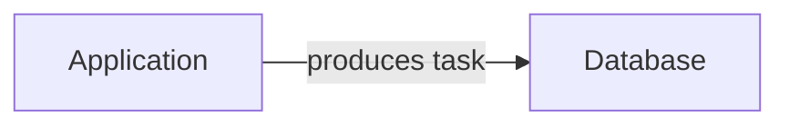

# Introduction

Lavoro is a library to easily queue up background jobs for long-running tasks.

Examples of long-running tasks are:

- Sending an email on new user sign-up
- Processing images or videos
- Generating a PDF report
- Creating and compressing a data backup

The distinguishing feature of all of these tasks is that the user will have to
wait for the task to finish for quite a while, staring at an unresponsive page.

While we **could** store these tasks in memory and process them in the same
process, this does not scale well and there is no way to persist tasks between
restarts.

**This is where worker queue comes in...**

## Queue

Instead of storing tasks in memory in the same process, we can store them in
some sort of database, typically Redis or PostgreSQL.

This enables us to decouple task processing from the main process, making it
light on the resources. This also helps limit the number of tasks being
processed at the same time, queueing them up and storing them in a persistent
storage which helps prevent data loss in case our application restarts.

Our application becomes a "task producer", it effectively sends tasks away
without concern of how and when they will be processed.

We can visualize it like this:

## Worker

The final piece of the puzzle is the worker — a process that consumes tasks from
the queue and processes them.

Historically, workers have been
[managed as a separate process](https://laravel.com/docs/12.x/queues#running-the-queue-worker)
for easy scaling, however with Lavoro you can choose what architecture to use.
In fact, you can start any number of producers and workers, or, if your
application is minimal, you can run both in the same application and scale it
out later without any changes to your task coordination logic.

Here are _some_ of the ways you can run Lavoro, which are supported out of the
box:

This is a typical one-to-many configuration, where a single app is producing
tasks and multiple workers are consuming them.

And when your application grows, just add more replicas of your app!

**It is that easy.** Distributed locking will take care of the coordination of
scheduling and running tasks exactly once.

Thanks to [distributed locking](/distributed-locking), Lavoro will automatically
distribute the tasks among workers in a way that the task will be executed
exactly once. It will also keep scheduled tasks from overlapping even if there
are multiple task producers.

## Motivation

While most of the examples you see on the Internet are using
[Redis](https://redis.io/) for worker queues (which is totally fine), there are
a few tradeoffs we have to consider.

In particular, by default, Redis is a
[**volatile** database](https://stackoverflow.com/questions/12609245/is-redis-data-volatile).
This means that it stores data in memory first and only persists it to disk
after some time. This is because Redis is designed to be used as a cache and
cache data is considered volatile by its nature. Therefore, ideally, you should
not rely on Redis for reliable and persistent data storage, even if modern cloud
solutions handle most of it for you.

As good engineers, we must be aware of the drawbacks of our tools.

Most of the background jobs libraries, such as [BullMQ](https://bullmq.io/) are
built for Redis and act more as a **message queue** (MQ is literally in the name
of the BullMQ).

In contrast, Lavoro is designed as a **task queue** first and therefore
prioritizes reliability over speed. Think of it this way: you want to create a
mission-critical task (i.e. sending an important email or capturing a form
request from a potential client).

**Losing this data is not an option.**

Because of this, the primary storage for Lavoro is
[PostgreSQL](https://www.postgresql.org/about/), which is
[ACID-compliant](https://en.wikipedia.org/wiki/ACID), which in turn means that
there are hard guarantees about data validity. This eliminates the whole class
of potential issues simply by using the correct tool at the architecture level.

## In short

Compared to most other background job libraries, Lavoro uses PostgreSQL because
it enables guarantees that the tasks you create will not be lost. Also, you can
reuse your existing infrastructure instead of bringing in another technology to
host and maintain.
